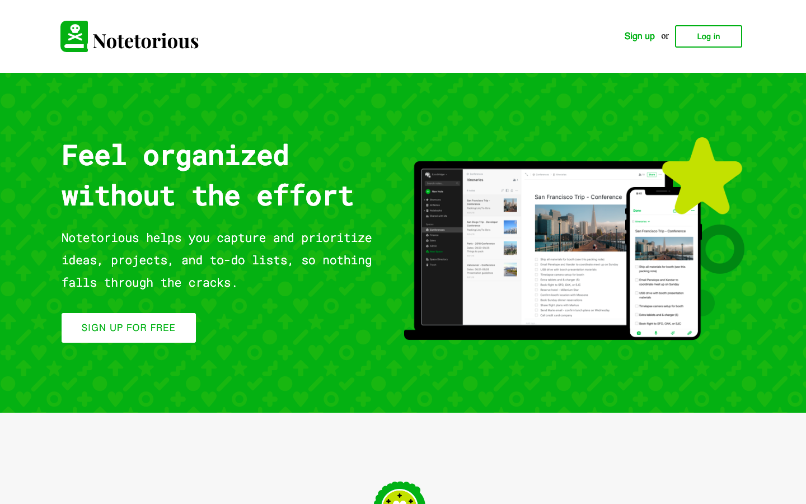
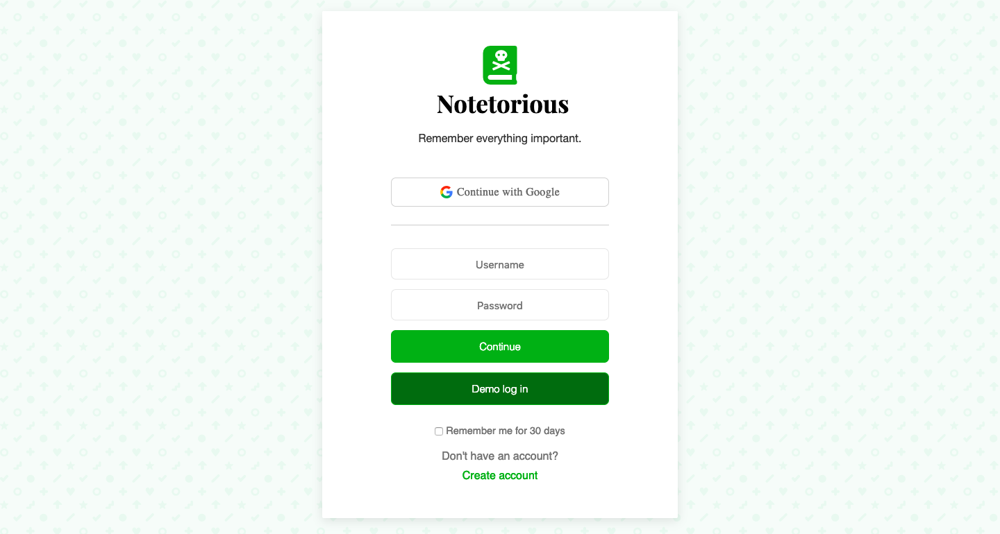

# Notetorious

Notetorious is a full-stack web application fully inspired by Evernote and built with Postgres, Express, React/Redux and NodeJS. Like Evernote, Notetorious helps users stay organized by allowing them to create, modify, tag and store notes in notebooks.

## Features

- Authentication using Passport.js for frontend/backend
- User account creation via signup and login or guest/demo login
- User can create, edit, delete notes and notebooks
- Rich-text editing via Quill.js
- Notes are searchable by title or content
- Notes can be favorited and added as shortcuts

## Screenshots






## Project Design Docs

View the original _[project proposal](./original-readme.md)_ to see to a README including all [wireframes](./wireframes), [api endpoints](./api-endpoints.md), [database schema](./schema.md), a sample React [component hierarchy](./component-hierarchy.md), a [sample state](./sample-state.md), and the implementation timeline that covers 3 weeks.

## Usage

#### Clone this repo

```
$ git clone https://github.com/SurgamSurgam/Notetorious.git && cd Notetorious
```

#### CD into `/backend` and run `npm install`

```
$ cd backend/ && npm install
```

#### CD into `/frontend` and run `npm install`

```
$ cd frontend/ && npm install
```

### Running Server

#### CD into `/notetorious` and Run `npm start`

```
$ npm start
```

## Future Implementations

- OAuth
- Allow sharing of notes/notebooks via social media
- Collaboration on notes
- Multiple sessions
- Add checklist/todo
- Create Reminders for Notes
- Autosave while editing
